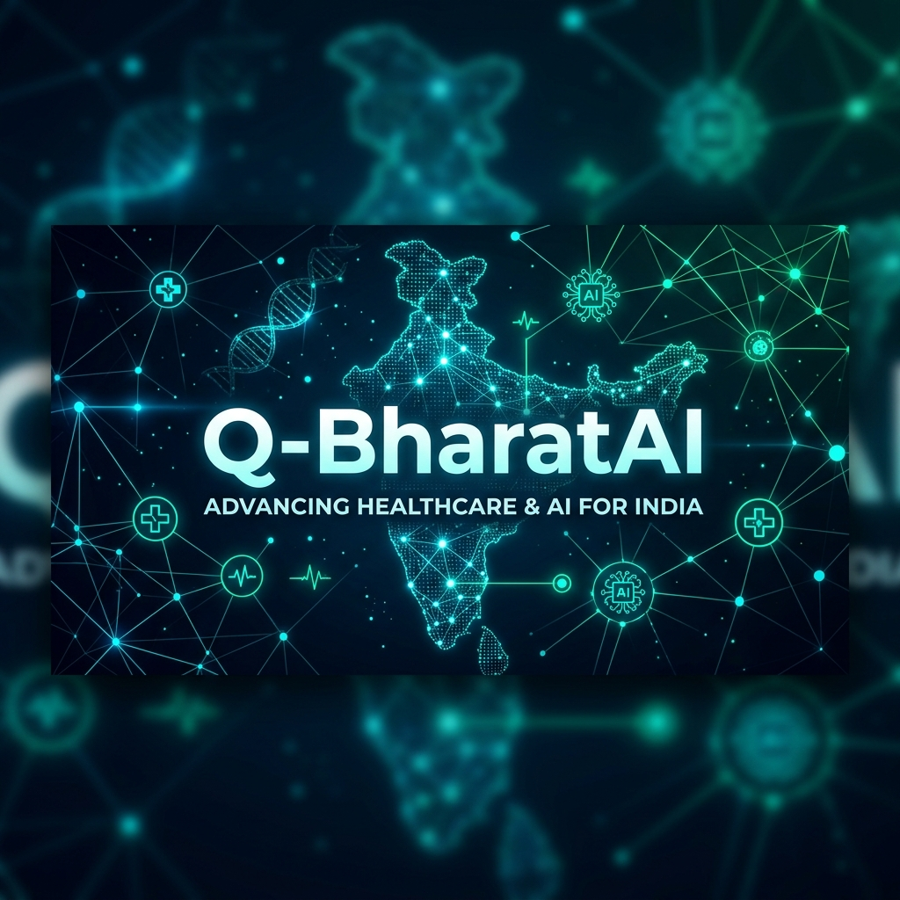
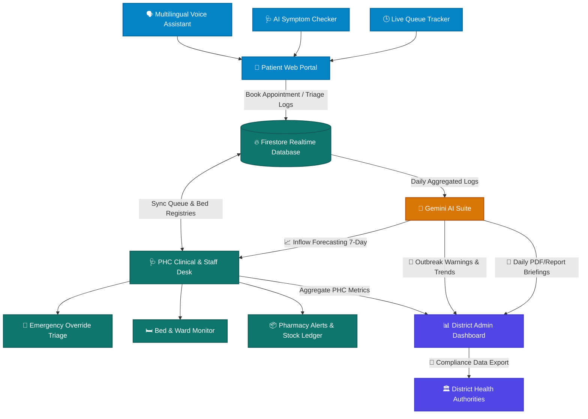

<p align="center">
  
</p>

# 🏥 Q-BharatAI-System 🇮🇳
> **Next-Generation, AI-Driven Public Health Operating System & Resource Optimizer for Primary Health Centers (PHCs) and District Administrations**

<p align="center">
  <a href="https://react.dev/"></a>
  <a href="https://www.typescriptlang.org/"></a>
  <a href="https://vite.dev/"></a>
  <a href="https://tailwindcss.com/"></a>
  <br>
  <a href="https://cloud.google.com/"></a>
  <a href="https://deepmind.google/technologies/gemini/"></a>
  <a href="https://firebase.google.com/"></a>
  <a href="https://nodejs.org/"></a>
  <br>
  <a href="https://github.com/shadab80k/Q-BharatAI-System/stargazers"></a>
  <a href="https://github.com/shadab80k/Q-BharatAI-System/network/members"></a>
  <a href="https://github.com/shadab80k/Q-BharatAI-System/issues"></a>
  <a href="https://github.com/shadab80k/Q-BharatAI-System/pulls"></a>
  <a href="https://github.com/shadab80k/Q-BharatAI-System/blob/main/LICENSE"></a>
</p>

---

## 📌 Overview

**Q-BharatAI-System** is a comprehensive, production-grade digital health management platform designed specifically for **Primary Health Centers (PHCs)** and **District Health Administrations** in India. It bridges the gap between patient accessibility and resource allocation by deploying local queue virtualization, multilingual triage, and district-level predictive analytics.

### 🌟 Why This Project Exists
In rural and semi-urban India, public health delivery is crippled by systemic inefficiencies. Patients travel long distances only to queue for hours at understaffed PHCs, language barriers prevent effective self-triage, and sudden stockouts of crucial medicines or hospital beds occur without warnings. Q-BharatAI serves as a unified digital ecosystem to bring efficiency, transparency, and predictive coordination to the public health layer.

### 🎯 Who It Helps
* **Rural Patients:** Eliminates physical wait times through queue virtualization and enables voice-commanded bookings in local languages.
* **PHC Medical Staff:** Reduces clinical burnout via emergency override triaging, intuitive consultation panels, and real-time inventory tracking.
* **District Health Officers:** Empowers administrators with cross-PHC telemetry, predictive medicine forecasting, and early outbreak warnings.

---

## ⚠️ Problem Statement

India's primary healthcare layer handles millions of patient visits daily but faces five major structural pain points:

```
┌────────────────────────────────────────────────────────────────────────┐
│                      RURAL HEALTHCARE PAIN POINTS                      │
├───────────────────┬───────────────────┬────────────────────────────────┤
│    Inefficient    │    Access &       │       Inventory & Supply       │
│      Queues       │    Language       │            Chain               │
│ 4-6 hour average  │ 22+ official      │ 35% drug stockout rate         │
│ physical waits.   │ languages.        │ in rural PHCs.                 │
└───────────────────┴───────────────────┴────────────────────────────────┘
```

1. **Unpredictable Wait Times:** Lack of scheduling systems causes severe overcrowding, leading to hospital acquired infections and lost daily-wage income.
2. **Digital Literacy & Language Barriers:** Standard health apps rely on English text forms, alienating rural patients who require intuitive, speech-driven interfaces.
3. **Critical Stockouts & Resource Leakage:** Essential drugs (e.g., ORS, Paracetamol, Antibiotics) and ward beds run out due to delayed reporting of consumption.
4. **Epidemiological Blindspots:** Epidemics (e.g., Dengue, Malaria) are flagged only after hospitals are overwhelmed, rather than at the initial symptom stages in PHCs.
5. **ABDM Compliance Gaps:** Fragmented, legacy health records fail to link with the Ayushman Bharat Digital Mission (ABDM) national registry.

---

## 💡 The Solution

Q-BharatAI solves these critical issues by integrating patient portals, clinical dashboards, and district analytics into a single data-driven loop.

```
  [Rural Patient] ──────► [Symptom Triage / Voice Assistant] ──► [Virtual Queue Token]
                                                                        │
                                                                        ▼
  [District Admin] ◄───── [AI Outbreak & Stock Forecasting] ◄─── [PHC Clinic Portal]
```

* **Dynamic Queue Virtualization:** Automatically updates wait-times on public portals and pushes SMS alerts, enabling patients to arrive only when called.
* **Multi-channel AI Triage:** Combines an offline-capable multilingual Voice Assistant and an AI Symptom Checker to route cases to the correct department.
* **Predictive Inventory System:** Tracks active drug consumption rates and predicts low-stock events 7 days in advance.
* **District Telemetry Hub:** Consolidates data from multiple PHCs to map disease vectors, coordinate bed capacities, and reallocate resources dynamically.

---

## 🛠️ Tech Stack

Q-BharatAI is built using modern, highly optimized technologies for speed, responsiveness, and clean codebase architecture:

### Frontend Layer
| Tech | Version | Role / Purpose |
| :--- | :--- | :--- |
| **React** | `19.0.0` | Core rendering library utilizing concurrent rendering features |
| **TypeScript** | `5.9.x` | Strict type-safety, contract enforcement, and developer velocity |
| **Vite** | `7.2.x` | Light-speed HMR development server and optimized bundle compiler |
| **Tailwind CSS** | `3.4.19` | High-performance, utility-first CSS styling engine |
| **shadcn/ui** | `Latest` | Radix-based customizable accessible UI primitives |
| **Framer Motion** | `12.4.x` | Fluid transitions, loading skeletons, and interactive animations |
| **TanStack Query** | `5.101.x` | Client-side cache management, automatic retries, and data synchronization |
| **Recharts** | `2.15.x` | Dynamic analytics visualizations, load forecasting, and outbreak charts |

### AI, Database & Cloud Infrastructure (Target Architecture)
| Layer | Service | Purpose |
| :--- | :--- | :--- |
| **AI LLM Engine** | `Gemini 1.5 Flash` | Natural language symptom extraction, multilingual translation, and briefings |
| **Cloud Database** | `Google Cloud Firestore` | Document database for real-time queue synchronization and bed statuses |
| **Serverless Backend**| `Google Cloud Run` | Dockerized Node.js services executing AI triage and report compile pipelines |
| **Object Storage** | `Google Cloud Storage` | Encrypted patient health reports and district performance PDFs |
| **Realtime Messaging**| `Firebase Cloud Messaging` | Multi-device push notifications and queue status alerts |
| **Voice Processing** | `Google Cloud Speech-to-Text` | Local voice recording transcription into regional dialects |
| **Geospatial Mapping**| `Google Maps API` | Heatmaps showing spatial disease outbreak distribution |

---

## 🏗️ System Architecture

The following diagram details the data flow between patients, clinical queues, AI intelligence pipelines, and district administration dashboards.



### Detailed Operational Data Flow
1. **Patient Booking Loop:** A patient speaks in a regional dialect to the Voice Assistant. The audio is transcribed, classified by the AI Symptom Checker, and categorized into general medicine, pediatrics, or cardiology.
2. **Dynamic Queue Triage:** A virtual token is generated. If the symptoms indicate severe chest discomfort, the system marks the case status as `emergency`, automatically overriding the regular queue sequence to place the patient next in line.
3. **PHC Synchronization:** The Clinic Desk interface synchronizes with Cloud Firestore in real time. Doctors click "Next Patient" to call, defer, or complete patient consultations.
4. **Predictive Analytics Pipeline:** In the background, daily consultations, disease symptom logs, and medication inventories are sent to the AI Suite. A predictive model forecasts future patient volumes and triggers replenishment orders for medicines classified as `low` or `critical` stock.
5. **Outbreak Vector Reporting:** Symptom groupings indicating vector-borne illnesses (e.g., dengue) are plotted geographically on a district administrator's maps.

---

## ✨ Features Breakdown

### Patient Portal
| Feature Card | Core Functionality | Impact & Benefit |
| :--- | :--- | :--- |
| **Virtual Queue Tracking** | Real-time queue positioning with dynamic wait estimations. | Prevents center overcrowding; saves patient travel times. |
| **Multilingual Voice Assistant**| Speech-to-text booking and symptom processing in regional Indian languages. | Empowers illiterate or elderly patients with accessibility. |
| **AI Symptom Checker** | Input symptom descriptions in natural language; returns risk priority. | Guides patients to the correct department; starts triage early. |
| **Live Medicine Registry** | Public ledger displaying essential medicine availability levels in the pharmacy. | Ensures transparency and prevents black-marketing. |

### Clinical & Staff Portal
| Feature Card | Core Functionality | Impact & Benefit |
| :--- | :--- | :--- |
| **Dynamic Queue Board** | Interactive kanban-like board to call, defer, and process patient consults. | Streamlines doctor workflow; cuts administration overhead. |
| **Emergency Triage Flag** | Highlighted override toggle to bump critical cases to position zero. | Saves lives during trauma or cardiovascular emergencies. |
| **Real-time Bed Monitor** | Dynamic visual grid showing occupied, available, and reserved beds in wards. | Optimizes referral systems and immediate admissions. |
| **Inventory Alert System** | Automated banners and emails signaling near-expiry and below-threshold stocks. | Eliminates stockouts of lifesaving antidotes. |

### District Admin & AI Suite
| Feature Card | Core Functionality | Impact & Benefit |
| :--- | :--- | :--- |
| **Outbreak Early Warnings** | Geospatial tracing of symptoms predicting outbreak hotspots. | Initiates vector spraying or containment before epidemics spread. |
| **Patient Load Forecasting** | 7-day predictive load models based on historical trends. | Enables smarter medical staff scheduling and roster management. |
| **Performance Scorecards** | Comparative analysis of patient volumes, treatment rates, and wait times. | Identifies bottlenecked PHCs to guide funding decisions. |
| **AI Briefing & Reports** | Natural language synthesis of daily operations, incidents, and tasks. | Cuts administrative paper trail; simplifies executive actions. |

---

## 🤖 AI Features & Prompt Flow

Our AI Integration uses **Gemini 1.5 Flash** to perform language understanding, medical coding, and time-series summaries:

```
[Voice Input] ──► [Whisper API / STT] ──► [Raw Text] ──► [Gemini 1.5 Flash] ──► [Triage & Department Mapping]
```

### 🗣️ Multilingual Voice Assistant
Allows patients to describe issues in regional languages. Gemini maps the colloquial vocabulary (e.g., *"mere pet me dard hai"* or *"tal me noora"* ) to unified clinical symptoms (`abdominal_pain`, `headache`) and assigns the appropriate department.

### 🩺 Smart Symptom Triage & Prompt Flow
The Symptom Checker queries the Gemini API with structured prompt formats:
* **System Prompt:** Act as an expert triage nurse in a resource-constrained rural clinic. Evaluate safety, categorize urgency (`routine`, `priority`, `critical`), and identify potential red flags.
* **Input Schema:** User symptoms, age, duration, chronic histories.
* **Output Format:** Validated JSON structure indicating `department`, `urgency_rating`, `suggested_first_aid`, and `red_flags`.

### 📈 Inflow Forecasting & Spatial Early Warning
Aggregates symptom statistics over 7-day cycles. If there is a localized surge of symptoms containing `chills` + `high_fever` + `joint_pain` in a single village block, the AI calculates a high-probability vector alert, flags it on the map dashboard, and notifies the district entomologist.

---

## ☁️ Cloud Architecture & Integration

Designed for target deployment on **Google Cloud Platform (GCP)** for security, scalability, and integration:

```
[Static Client Site] ──► Google Cloud Storage / Firebase Hosting
[Backend API Engine] ──► Google Cloud Run (Containerized Docker microservices)
[Database & Queue]   ──► Cloud Firestore (Real-time sync listeners)
[Heavy Analytics]    ──► BigQuery (Long-term disease reporting warehouse)
[Media & PDFs]       ──► Cloud Storage
[Notification Push]  ──► Firebase Cloud Messaging (FCM)
```

* **Firestore Real-time Listeners:** Active queue counters are broadcast via Firestore snapshot listeners to patient browsers, enabling instant updates.
* **Cloud Run Scaling:** Auto-scales backends from zero to handle sudden morning triage spikes when thousands of bookings occur, maintaining low latency.
* **Firebase Authentication:** Handles passwordless email authentication, OTP verification for staff, and unified health ID bindings.

---

## 🔒 Security, Compliance & Governance

Patient data safety and national healthcare standards are core pillars of Q-BharatAI:

> [!IMPORTANT]
> **Consent-Based Architecture & Regulatory Adherence**
> The platform is fully designed in alignment with both Indian health registries and data protection mandates.

* **ABDM (Ayushman Bharat Digital Mission) Integration:** Fully supports linking of **ABHA IDs** (Ayushman Bharat Health Account) and digital consent flows. Telemetry and diagnostics are tied directly to ABHA cards for paperless medical transfers.
* **DPDP (Digital Personal Data Protection Act, 2023) Compliance:**
  * **Explicit Consent:** Patient records cannot be viewed by other doctors without active, temporal OTP-based consent.
  * **Anonymized Analytics:** Shared district telemetry is fully stripped of Personally Identifiable Information (PII) before analytical queries run.
  * **Right to Erasure:** Patients can request deletion of booking histories via their profile portal.
* **Role-Based Access Control (RBAC):**
  * **Patient:** Access to booking slots, profiles, and queue tracking.
  * **Doctor:** Full clinical records access, triage updates, and lab ordering.
  * **Pharmacist:** Inventory management and prescription dispensing logs.
  * **District Admin:** Consolidated, anonymized PHC analytics, report compiling.

---

## ⚡ Scalability & Performance Optimizations

Q-BharatAI utilizes cutting-edge optimization techniques to operate reliably in rural networks:

* **Caching & Hydration:** Leverages **TanStack Query** for client-side caching. Repeated requests for doctor profiles, medicine names, and static maps utilize Cache-Control and Stale-While-Revalidate strategies, saving precious bandwidth.
* **Code-Splitting & Lazy Loading:** Dashboard portals are lazy-loaded via React Suspense, shrinking the initial bundle size to under **150 KB** for immediate loading on slow 3G/4G connections.
* **Firestore Offline Support:** Uses Firestore's local persistence. If a clinic's internet connection drops, doctors can continue to call and update queues. The data synchronizes automatically once connection restores.
* **PWA Capability:** Configured as a Progressive Web App (PWA) allowing local desktop and mobile installs with asset caching.

---

## 📊 API Documentation

The platform interacts with a microservice backend via standard RESTful endpoints:

### Authentication Endpoints
| Method | Endpoint | Description | Headers / Auth |
| :--- | :--- | :--- | :--- |
| `POST` | `/api/v1/auth/register` | Register a new patient/staff user. | None |
| `POST` | `/api/v1/auth/login` | Login and retrieve JWT authentication tokens. | None |
| `GET` | `/api/v1/auth/me` | Fetch user profile and role details. | Bearer JWT |

### Queue & Triage Endpoints
| Method | Endpoint | Description | Headers / Auth |
| :--- | :--- | :--- | :--- |
| `POST` | `/api/v1/queue/book` | Submit symptom description and get queue token. | Bearer JWT |
| `GET` | `/api/v1/queue/live/:phcId` | Fetch live virtual queue list for a PHC. | None |
| `PATCH`| `/api/v1/queue/update/:tokenId` | Update ticket status (`in-progress`, `completed`). | Bearer JWT (Doctor) |
| `POST` | `/api/v1/queue/emergency` | Manually insert a critical case to top of queue. | Bearer JWT (Staff) |

### Inventory & Wards
| Method | Endpoint | Description | Headers / Auth |
| :--- | :--- | :--- | :--- |
| `GET` | `/api/v1/inventory/:phcId` | Retrieve full pharmacy medicine list and stock levels.| Bearer JWT |
| `PATCH`| `/api/v1/inventory/dispense` | Record prescription dispensing; decrements stock. | Bearer JWT (Pharmacist)|
| `GET` | `/api/v1/beds/:phcId` | Get occupancy map of ICU and General wards. | Bearer JWT |

---

## 📂 Folder Structure

The project code is clean, modular, and organized following standard React architecture patterns:

```text
Q-BharatAI-System/
├── assets/                     # Graphic design assets and screenshots
├── src/
│   ├── components/             # Reusable UI component library
│   │   ├── ui/                 # shadcn/ui custom styled primitives
│   │   └── layout/             # Sidebar, Header, and AppLayout wrappers
│   ├── context/                # Global contexts (Auth, Theme, Notifications)
│   ├── data/                   # Static configurations, charts, and mock datasets
│   ├── hooks/                  # Reusable hooks (useAuth, local storage triggers)
│   ├── lib/                    # Core configuration and Tailwind helper utilities
│   ├── pages/                  # Views grouped logically by portal access
│   │   ├── ai/                 # Forecasts, Outbreak telemetry, Daily summaries
│   │   ├── district/           # Analytical scorecards and performance gauges
│   │   ├── patient/            # Bookings, Live queue, Voice assistant, Symptom checker
│   │   └── staff/              # Clinical dashboard, Bed monitor, Stock registers
│   ├── types/                  # TypeScript model interface declarations
│   ├── App.css                 # Route animations and global overrides
│   ├── App.tsx                 # Client-side router mappings
│   ├── index.css               # Core Tailwind directives & Shadcn design tokens
│   └── main.tsx                # Client app bootstrapper
├── .env.example                # Config template file
├── tailwind.config.js          # Tailwind styling custom configurations
└── vite.config.ts              # Vite compiler config & build options
```

---

## 🚀 Getting Started & Installation

Follow these setup steps to run the Q-BharatAI-System client application on your local workstation.

### Prerequisites
* **Node.js** version `20.x` or `22.x` (LTS versions)
* **npm** (comes with Node) or **yarn** package manager

### 1. Clone the Repository
```bash
git clone https://github.com/shadab80k/Q-BharatAI-System.git
cd Q-BharatAI-System
```

### 2. Install Project Dependencies
Run npm install to download packages, shadcn widgets, and charting libraries:
```bash
npm install
```

### 3. Setup Environment Variables
Create your local environment file:
```bash
cp .env.example .env
```
Open `.env` in your editor and enter your credentials (e.g. your Gemini API key, Firebase configs, Google Maps keys).

### 4. Launch the Development Server
Run the local Vite server:
```bash
npm run dev
```
Open [http://localhost:5173](http://localhost:5173) in your browser.

### 5. Production Compilation & Build
To build the application for deployment:
```bash
npm run build
```
Vite will compile and compress elements, saving output files in the `/dist` directory.

---

## 📷 Screenshots

| Dashboard View | Landing Page | Patient Portal |
| :---: | :---: | :---: |
|  |  |  |
| *Clinical & Staff Desk* | *Platform Portal Gateway* | *Voice & Virtual Queue Booking* |

| District Analytics | AI Outbreak Tracker |
| :---: | :---: |
|  |  |
| *Cross-PHC Performance Scores* | *Spatial Outbreak Radar* |

---

## 🎥 Live Demo & Presentation

* **Live Web App:** [https://q-bharatai-system.web.app](https://q-bharatai-system.web.app) *(Mock deployment link)*
* **Video Walkthrough:** [YouTube Video Walkthrough Link](https://youtube.com) *(Demo pitch and feature summary)*

---

## 🗺️ Product Roadmap

- [x] **Virtual Queue Dashboard:** Real-time token caller and dynamic wait algorithm.
- [x] **Emergency Override:** Clinic-facing priority toggle.
- [x] **Visual Charting:** Live bed trackers and pharmacy low-stock dashboards.
- [x] **Multilingual Interface:** UI layouts for Patient, Staff, and District roles.
- [ ] **Offline PWA Engine:** Local database replication with synchronization protocols for rural regions.
- [ ] **Ayushman Bharat ABDM Sandbox:** Live sandbox integration for patient ABHA verification.
- [ ] **SMS Gateway Integration:** Twilio/MSG91 fallback protocols for queue status updates.
- [ ] **Spatial Vector Predictive Engine:** Multi-variant forecasting to identify malaria outbreaks.

---

## 👥 Meet Team Hacker Heist

We are a team of software developers and health-tech enthusiasts dedicated to creating scalable engineering solutions for public health.

| Name | Role | GitHub Profile |
| :--- | :--- | :--- |
| **Shadab Khan** | Lead Fullstack Engineer | [@shadab80k](https://github.com/shadab80k) |
| **Collaborator One** | AI & Data Pipelines Engineer | [@hackerheist](https://github.com) |
| **Collaborator Two** | UI/UX & Cloud Architecture | [@hackerheist](https://github.com) |

---

## 🤝 Contributing

Contributions make the open-source community an amazing place to learn, inspire, and create. Any contributions you make are **greatly appreciated**.

1. Fork the Project.
2. Create your Feature Branch (`git checkout -b feature/AmazingFeature`).
3. Commit your Changes (`git commit -m 'Add some AmazingFeature'`).
4. Push to the Branch (`git push origin feature/AmazingFeature`).
5. Open a Pull Request.

Please read our [CONTRIBUTING.md](https://github.com/shadab80k/Q-BharatAI-System/blob/main/CONTRIBUTING.md) *(planned)* for details on our code of conduct and style guide.

---

## 📄 License

This project is licensed under the MIT License - see the [LICENSE](LICENSE) file for details.

---

## 💖 Acknowledgements

* **Google Cloud Hackathon Organizers** for providing the API sandboxes.
* **Google Gemini Developer Team** for the generative AI models API.
* **National Health Authority (NHA)** of India for ABDM APIs definitions and protocols documentation.
* **The Open Source Community** for tools like Tailwind, React, and Vite that speed up prototyping.

---
<p align="center">
  Made with ❤️ by <b>Team Hacker Heist</b> for a Healthier and Digitally Connected India 🇮🇳
</p>
